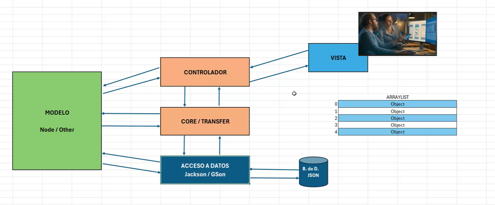

# proyecto trata sobre libros con lista simplemente ligadas

1. Capa de la Vista: se solicitan los datos al usuario.
2. Capa del Controlador: delega las funciones y llama a métodos CRUD.
3. Capa de Core/Transfer: contiene los métodos CRUD, realiza la acción y devuelve un objeto Java.
4. El objeto Java es agregado a un ArrayList en memoria.
5. Capa de Acceso a Datos: el ArrayList se transforma a JSON usando la librería Jackson o Gson.
6. El JSON se guarda en un archivo .json.

